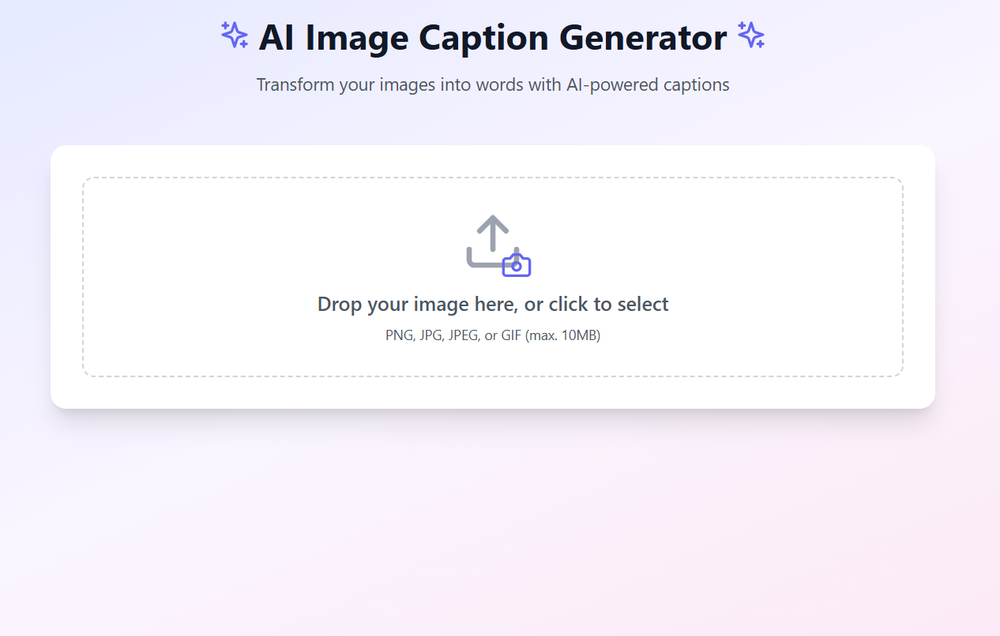

# AI Image Caption Generator 🖼️✨

A modern, user-friendly web application that generates AI-powered captions for your images using OpenAI's advanced vision model. Built with React, TypeScript, and Tailwind CSS.



## ✨ Features

- 🤖 AI-powered image analysis and caption generation
- 📝 Dual caption generation:
  - Concise 3-4 word descriptions
  - Detailed two-line descriptions
- 🎨 Beautiful, responsive UI with smooth animations
- 📱 Mobile-friendly design
- 🔄 Drag-and-drop file upload
- 📋 One-click copy to clipboard
- 💫 Share capabilities (on supported devices)
- ⬇️ Image download functionality
- 📊 Image statistics display (size and format)
- 🎯 Error handling with retry options

## 🚀 Tech Stack

- **Frontend Framework**: React with TypeScript
- **Styling**: Tailwind CSS
- **Icons**: Lucide React
- **AI Integration**: OpenAI Vision API
- **Build Tool**: Vite
- **File Handling**: React Dropzone

## 🛠️ Installation

1. Clone the repository:

   ```bash
   git clone [your-repository-url]
   cd ai-image-caption-generator
   ```

2. Install dependencies:

   ```bash
   npm install
   ```

3. Create a `.env` file in the root directory and add your OpenAI API key:

   ```env
   VITE_OPENAI_API_KEY=your_api_key_here
   ```

4. Start the development server:
   ```bash
   npm run dev
   ```

## 💻 Usage

1. Open the application in your browser
2. Drop an image or click to select one
3. Wait for the AI to analyze your image
4. View both brief and detailed captions
5. Copy, share, or download as needed

## 🔒 Security

- Environment variables are used for API key protection
- Client-side file size validation
- Secure API communication

## ⚡ Performance

- Optimized image handling
- Responsive design for all devices
- Efficient state management
- Smooth animations and transitions

## 🎯 Limitations

- Maximum file size: 10MB
- Supported formats: PNG, JPG, JPEG, GIF
- Requires an active internet connection
- OpenAI API key required

## 📝 License

This project is licensed under the MIT License - see the [LICENSE](LICENSE) file for details.

## 🤝 Contributing

Contributions, issues, and feature requests are welcome! Feel free to check the [issues page](issues).

## 🙏 Acknowledgments

- OpenAI for their powerful vision API
- The React and Tailwind CSS communities
- All contributors and users of this project

---

Made with ❤️ using React, TypeScript, and OpenAI
